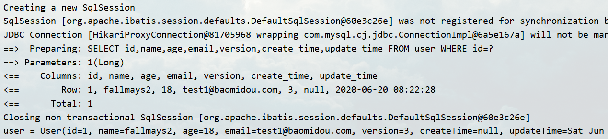

#  Mybatis Plus

> 简介 

什么是 MybatisPlus？ —— <font color='red'> 简化 Mybatis (而 Mybatis 则是简化 JDBC)，类似 JPA</font>

## 特性

- **无侵入**：只做增强不做改变，引入它不会对现有工程产生影响，如丝般顺滑
- **损耗小**：启动即会自动注入基本 CURD，性能基本无损耗，直接面向对象操作
- **强大的 CRUD 操作**：内置通用 Mapper、通用 Service，仅仅通过少量配置即可实现单表大部分 CRUD 操作，更有强大的条件构造器，满足各类使用需求
- **支持 Lambda 形式调用**：通过 Lambda 表达式，方便的编写各类查询条件，无需再担心字段写错
- **支持主键自动生成**：支持多达 4 种主键策略（内含分布式唯一 ID 生成器 - Sequence），可自由配置，完美解决主键问题
- **支持 ActiveRecord 模式**：支持 ActiveRecord 形式调用，实体类只需继承 Model 类即可进行强大的 CRUD 操作
- **支持自定义全局通用操作**：支持全局通用方法注入（ Write once, use anywhere ）
- **内置代码生成器**：采用代码或者 Maven 插件可快速生成 Mapper 、 Model 、 Service 、 Controller 层代码，支持模板引擎，更有超多自定义配置等您来使用
- **内置分页插件**：基于 MyBatis 物理分页，开发者无需关心具体操作，配置好插件之后，写分页等同于普通 List 查询
- **分页插件支持多种数据库**：支持 MySQL、MariaDB、Oracle、DB2、H2、HSQL、SQLite、Postgre、SQLServer 等多种数据库
- **内置性能分析插件**：可输出 Sql 语句以及其执行时间，建议开发测试时启用该功能，能快速揪出慢查询
- **内置全局拦截插件**：提供全表 delete 、 update 操作智能分析阻断，也可自定义拦截规则，预防误操作


## 快速入门  [地址]([https://mp.baomidou.com/guide/quick-start.html#%E5%88%9D%E5%A7%8B%E5%8C%96%E5%B7%A5%E7%A8%8B](https://mp.baomidou.com/guide/quick-start.html#初始化工程))

- 导入依赖
- 研究依赖配置
- 编写代码
- 扩展插件

> 建立数据库 ( 仅提供测试使用 )

```sql
DROP TABLE IF EXISTS user;

CREATE TABLE user
(
	id BIGINT(20) NOT NULL COMMENT '主键ID',
	name VARCHAR(30) NULL DEFAULT NULL COMMENT '姓名',
	age INT(11) NULL DEFAULT NULL COMMENT '年龄',
	email VARCHAR(50) NULL DEFAULT NULL COMMENT '邮箱',
	PRIMARY KEY (id)
);
DELETE FROM user;

INSERT INTO user (id, name, age, email) VALUES
(1, 'Jone', 18, 'test1@baomidou.com'),
(2, 'Jack', 20, 'test2@baomidou.com'),
(3, 'Tom', 28, 'test3@baomidou.com'),
(4, 'Sandy', 21, 'test4@baomidou.com'),
(5, 'Billie', 24, 'test5@baomidou.com');
```

> 编写项目

```xml
<!-- 配置 Mybatis-plus 后就不用配置 Mybatis -->
<!-- 3.0.5 旧版本，功能实现比较原生化(学习使用) -->
<dependency>
    <groupId>com.baomidou</groupId>
    <artifactId>mybatis-plus-boot-starter</artifactId>
    <version>3.0.5</version>
</dependency>

<dependency>
    <groupId>mysql</groupId>
    <artifactId>mysql-connector-java</artifactId>
    <scope>runtime</scope>
</dependency>
<dependency>
    <groupId>org.projectlombok</groupId>
    <artifactId>lombok</artifactId>
    <optional>true</optional>
</dependency>
```

<font color='red'>说明</font>：不要同时导入 Mybatis 和 Mybatis-plus。Mybatis-plus 可以节省大量代码。

> 数据库配置简要说明：(Mysql8要增加时区：serverTimezone)

```properties
spring.datasource.username=root
spring.datasource.password=12345
spring.datasource.url=jdbc:mysql://127.0.0.1:4096/mybatis_plus?useSSL=false&useUnicode=true&characterEncoding=utf-8
spring.datasource.driver-class-name=com.mysql.cj.jdbc.Driver
```

<font color='red'>传统编写：pojo - dao(连接 mysql ，配置 mapper.xml) - service - controller </font>

mybatis-plus：pojo、mapper 接口

> pojo

```java
@Data
@AllArgsConstructor
@NoArgsConstructor
public class User {
    private Long id;
    private String name;
    private String age;
    private String email;
}
```

> Mapper 接口

```java
@SpringBootTest
class DemoApplicationTests {
	@Autowired
	private UserMapper  userMapper;
	@Test
	void contextLoads() {
		// 查询全部用户
		// 参数 Wrapper 是条件构造器 ——可为空
		List<User> users = userMapper.selectList(null);
		users.forEach(System.out::println);
	}
}
```

> 主程序扫描 Mapper  包

```java
@MapperScan("com.example.demo.mapper")
@SpringBootApplication
public class DemoApplication {
	public static void main(String[] args) {
		SpringApplication.run(DemoApplication.class, args);
	}
}
```

> 测试结果

```
User(id=1, name=Jone, age=18, email=test1@baomidou.com)
User(id=2, name=Jack, age=20, email=test2@baomidou.com)
User(id=3, name=Tom, age=28, email=test3@baomidou.com)
User(id=4, name=Sandy, age=21, email=test4@baomidou.com)
User(id=5, name=Billie, age=24, email=test5@baomidou.com)
```

> > ##### 总结：Mysql-plus 具有与 Jpa 相似的功能，将简单的查询进行封装供使用者使用。


## 配置日志

所有 SQL 是不可见的，如果我们想对 SQL 查询进行查看，则可以进行日志配置方便测试学习。

```properties
# 配置日志
mybatis-plus.configuration.log-impl=org.apache.ibatis.logging.stdout.StdOutImpl
```


## CRUD 扩展

### Insert 插入

```java
@Test
public void testInsert(){
    User user = new User();
    user.setName("testMybatis-plus");
    user.setAge(3);
    user.setEmail("1538211287@qq.com");
    int testNum = userMapper.insert(user);
    System.out.println("testNum = " + testNum);
    System.out.println("user = " + user);
}
```

**注意点：自带生成 id ，数据库插入的 id 值为全局的唯一 id**


> > 数据库的主键：(uuid、自增 id 、雪花算法(分布式) ) [具体博客](https://www.cnblogs.com/haoxinyue/p/5208136.html)
> >
> > - uuid：随机生成，全球唯一。但是传输数据量大、不可读、无序……
> > - 自增 id：简单便捷、单表数据唯一，但是不同数据库语法实现不同，单个数据库或读写分离或一主多从情况下，只有一个主库可以生成。有单点故障的风险，难以扩展……

### <font color='red'> 雪花算法( Twitter — snowflake 算法) ：</font>

>   snowflake是Twitter开源的分布式ID生成算法，结果是一个long型的ID。其核心思想是：使用41bit作为毫秒数，10bit作为机器的ID（5个bit是数据中心，5个bit的机器ID），12bit作为毫秒内的流水号（意味着每个节点在每毫秒可以产生 4096 个 ID），最后还有一个符号位，永远是0。具体实现的代码可以参看https://github.com/twitter/snowflake。

1. **1bit**，不用，因为二进制中最高位是符号位，1表示负数，0表示正数。生成的id一般都是用整数，所以最高位固定为0。
2. **41bit-时间戳**，用来记录时间戳，毫秒级。
    \- 41位可以表示个数字，
    \- 如果只用来表示正整数（计算机中正数包含0），可以表示的数值范围是：0 至 ，减1是因为可表示的数值范围是从0开始算的，而不是1。
    \- 也就是说41位可以表示个毫秒的值，转化成单位年则是%20%2F%20(1000%20*%2060%20*%2060%20*%2024%20*365)%20%3D%2069)年
3. **10bit-工作机器id**，用来记录工作机器id。
    \- 可以部署在个节点，包括5位datacenterId和5位workerId
    \- 5位（bit）可以表示的最大正整数是，即可以用0、1、2、3、....31这32个数字，来表示不同的datecenterId或workerId
4. **12bit-序列号**，序列号，用来记录同毫秒内产生的不同id。
    \-  12位（bit）可以表示的最大正整数是，即可以用0、1、2、3、....4094这4095个数字，来表示同一机器同一时间截（毫秒)内产生的4095个ID序号。

> > 对 Mybatis-plus 的 TableId(IdType ..) "@TableId(type = IdType.*)" 的简单分析：

```java
package com.baomidou.mybatisplus.annotation;
public enum IdType {
    AUTO(0),
    NONE(1),
    INPUT(2),
    ID_WORKER(3),
    UUID(4),
    ID_WORKER_STR(5);

    private int key;

    private IdType(int key) {
        this.key = key;
    }

    public int getKey() {
        return this.key;
    }
}
```

- **默认 ID_WORKER：** 全局唯一 id。
- **AUTO：**主键自增，若已有数据，则会在已有的数字上进行自增。
- NONE：不进行操作（未设置主键）。
- INPUT：手动输入（必须自己配置 id  *.setId(.......)）。
- UUID：全局唯一 id。
- ID_WORKER_STR：ID_WORKER 字符串表示法。

### Update 更新

```java
@Test
public void testUpdate(){
    User user = new User();
    user.setId(1L);
    user.setName("gzkemays");
    int i = userMapper.updateById(user);
    System.out.println("i = " + i);
}
```


**注意点：自动拼接动态 SQL，自动添加 where id = ?**


### 自动填充

创建时间、修改时间！这些操作都是自动化完成的，不希望手动更新。

所有的数据库表：gmt_create（创建时间）、gmt_modified（更新时间） 几乎所有表都要配置且需要自动化。

> 方式一：数据库级别 ( 工作中不修改数据库 )

1、在表中新增字段 create_time、update_time


2、添加字段

```java
@Data
@AllArgsConstructor
@NoArgsConstructor
public class User {
    private Long id;
    private String name;
    private Integer age;
    private String email;
    private Date createTime;
    private Date updateTime;
}
```

3、再次插入数据后


> 方式二：代码级别

1、数据中没有默认设置


2、实体类字段属性上需要增加注解

```java
@Data
@AllArgsConstructor
@NoArgsConstructor
public class User {
    private Long id;
    private String name;
    private Integer age;
    private String email;

    @TableField(fill = FieldFill.INSERT)
    private Date createTime;
    @TableField(fill = FieldFill.UPDATE)
    private Date updateTime;
}
```

**@TableField 的源代码**：

- ```java
  @Documented
  @Retention(RetentionPolicy.RUNTIME)
  @Target({ElementType.FIELD})
  public @interface TableField {
      String value() default "";
  
      String el() default "";
  
      boolean exist() default true;
  
      String condition() default "";
  
      String update() default "";
  
      FieldStrategy strategy() default FieldStrategy.DEFAULT;
  
      FieldFill fill() default FieldFill.DEFAULT;
  
      boolean select() default true;
  }
  ```

- fill()  — 填充  的源代码

  ```java
  public enum FieldFill {
      DEFAULT,
      INSERT,
      UPDATE,
      INSERT_UPDATE;
  
      private FieldFill() {
      }
  ```

  - DEFAULT：默认不填充
  - INSERT：插入时填充
  - UPDATE：更新时填充
  - INSERT_UPDATE：更新和插入时填充

  

3、编写处理器对注解进行处理：
```java
  @Component
public class MyMetaObjectHandler implements MetaObjectHandler {
      // 插入时填充策略
      @Override
      // setFieldValByName(String fieldName, Object fieldVal, MetaObject metaObject)
      public void insertFill(MetaObject metaObject) {
          System.out.println("start insert fill");
          this.setFieldValByName("createTime",new Date(),metaObject);
          this.setFieldValByName("updateTime",new Date(),metaObject);
      }
      // 更新时填充策略
      @Override
      public void updateFill(MetaObject metaObject) {
          System.out.println("start update fill");
          this.setFieldValByName("updateTime",new Date(),metaObject);
      }
  }
```

 重新插入数据：

  

更新数据：

  

 数据库结果：(一般在创建时间处的 TableField 的填充设置：INSERT_UPDATE) 此处为效果明显所以分开设置。

 

 此处可见，即使在 Handler 声明在 InsertFill 执行时候添加 updateTime 的数据，但是如果 updateTime 并没有进行注解声明可以在 Insert 进行填充时，Handler 则无法在 InsertFill 过程中找到对应的属性（IOC）。

### 乐观锁

- 乐观锁：顾名思义十分乐观，它总是认为不会出现问题，无论如何都不会上锁，如果出现了问题，则在第二次更新时进行测试。
- 悲观锁：顾名思义十分悲观，它总是认为会出现问题，无论如何都会进行上锁，再进行具体操作。

>当要更新一条记录的时候，希望这条记录没有被别人更新
>
>>乐观锁实现方式：
>>- 取出记录时，获取当前 version
>>- 更新时，带上这个 version
>>- 执行更新时， set version = newVersion where version = oldVersion
>>- 如果 version 不对，就更新失败
>>
>>```sql
>>1、取出记录时先获取当前 version(可指某一数据,此处以 version 为例子) -> version = 1
>>2 ~ 3、更新数据时带上以获得的 version,此处做 +1 的更新：
>>	update user set name ="gzkemays",version = version+1 where id = 1 and version = 1 
>>4、version 不对(设 version = 1)：
>>-- A：获取到的 version 已经被更新 version = 2 != 1,则 A 就更新失败。
>>	update user set name ="gzkemays",version = version+1 where id = 1 and version = 1 
>>-- B 比 A 更早的完成更新操作：更新了 version 令 version = 2。
>>	update user set name ="gzkemays",version = version+1 where id = 1 and version = 1 
>>```

> 实现测试乐观锁：

1、数据库的改动：


2、实体类添加字段

```java
@Data
@AllArgsConstructor
@NoArgsConstructor
public class User {
    private Long id;
    private String name;
    private Integer age;
    private String email;
    // 乐观锁的注解
    @Version
    private Integer version;
    @TableField(fill = FieldFill.INSERT_UPDATE)
    private Date createTime;
    @TableField(fill = FieldFill.UPDATE)
    private Date updateTime;
}
```

3、注册组件

```java
// 扫描 Mapper 文件夹
@MapperScan("com.example.demo.mapper")
// 管理事务
@EnableTransactionManagement
@Configuration
public class MybatisPlusConfig {
    // 注册乐观锁插件
    @Bean
    public OptimisticLockerInterceptor optimisticLockerInterceptor(){
        return new OptimisticLockerInterceptor();
    }
}
```

4、测试

```java
@Test
// 乐观锁成功进行
public void testLockedSucces(){
   User user = userMapper.selectById(1L);
   user.setName("fallmays");
   userMapper.updateById(user);
}
```


```java
	// 乐观锁进行失败，多线程，形成 ABA 情况。
	@Test
	public void testLockedFail(){
		// A 线程
		User user = userMapper.selectById(1L);
		user.setName("fallmays1");

		// B线程
		User user2 = userMapper.selectById(1L);
		user2.setName("fallmays2");

		// 先执行 B 线程
		userMapper.updateById(user2);
		// 后执行 A 线程，如果没乐观锁则默认情况下 fallmays2 会覆盖 fallmays1
		// 自旋锁会多次尝试提交！
		userMapper.updateById(user);
	}
```


**从图片中很明显看得出，在模拟插队发生后，<font color='red'>A</font> 并没进行覆盖更新，而是跳出。（因为它们 select <font color='red'>查询到的 version 都是等于 2</font>，但是 <font color='red'>B</font> 却抢先执行更新。）**


### Select 查询

```java
	@Test
	public void testSelect(){
		// 根据 id 查询单个 User
		User user = userMapper.selectById(1L);
		System.out.println("user = " + user);
		// 根据 id 列表查询多个 User
		List<User> users = userMapper.selectBatchIds(Arrays.asList(1,2,3));
		users.forEach(System.out::println);
		// 条件查询
		HashMap<String,Object> map = new HashMap<>();
		// put 进条件动态添加 where and 条件
		map.put("name","fallmays2");
		userMapper.selectByMap(map);
		users.forEach(System.out::println);
	}
```

- 

- 

- 


### 分页查询

- 原始 limit 分页
- pageHelper 第三方插件
- Mybatis-plus 分页插件

> 使用 mp 的分页插件

**官方文档**：

```xml
<!-- spring xml 方式 -->
<property name="plugins">
    <array>
        <bean class="com.baomidou.mybatisplus.extension.plugins.PaginationInterceptor">
            <property name="sqlParser" ref="自定义解析类、可以没有"/>
            <property name="dialectClazz" value="自定义方言类、可以没有"/>
            <!-- COUNT SQL 解析.可以没有 -->
            <property name="countSqlParser" ref="countSqlParser"/>
        </bean>
    </array>
</property>

<bean id="countSqlParser" class="com.baomidou.mybatisplus.extension.plugins.pagination.optimize.JsqlParserCountOptimize">
    <!-- 设置为 true 可以优化部分 left join 的sql -->
    <property name="optimizeJoin" value="true"/>
</bean>
```

<hr/>

```java
@Bean
@EnableTransactionManagement
@Configuration
@MapperScan("com.baomidou.cloud.service.*.mapper*")
public class MybatisPlusConfig {
	public PaginationInterceptor paginationInterceptor() {
    PaginationInterceptor paginationInterceptor = new PaginationInterceptor();
    // 设置请求的页面大于最大页后操作， true调回到首页，false 继续请求  默认false
    // paginationInterceptor.setOverflow(false);
    // 设置最大单页限制数量，默认 500 条，-1 不受限制
    // paginationInterceptor.setLimit(500);
    // 开启 count 的 join 优化,只针对部分 left join
    paginationInterceptor.setCountSqlParser(new JsqlParserCountOptimize(true));
    return paginationInterceptor;
	}
}
```
**简单使用：**

```java
@Bean
public PaginationInterceptor paginationInterceptor() {
    return new PaginationInterceptor();
}
```

```java
@Test
public void testPage(){
   // ?1 = 当前页 ?2 = 页面大小
   Page<User> page = new Page<>(1,5);
   userMapper.selectPage(page,null);
   page.getRecords().forEach(System.out::println);

}
```


###  Delete 删除

```java
@Test
public void testDelete(){
   userMapper.deleteById(1L);
   userMapper.deleteBatchIds(Arrays.asList(1,2,3));
   HashMap<String,Object> map = new HashMap<>();
   map.put("name","fallmays2");
   userMapper.deleteByMap(map);
}
```

**基本的删除操作与 select 几乎相同**

### 逻辑删除

- 物理删除：从数据库中直接移除。
- 逻辑删除：在数据库中没有移除，而是通过变量使它失效。

1、在数据库中添加一个属性（Boolean 布尔属性）


1.1、或使用 Hibernate 自动生成

```java
# 配置文件中：
# jpa 将实体类更新至数据库
spring.jpa.hibernate.ddl-auto=update
# 默认就是 false 关闭 Hibernate SQL 的输出
spring.jpa.show-sql=false


@Data
@AllArgsConstructor
@NoArgsConstructor
@Entity
@Table(name = "user")
public class User {
    @Id
    @TableId(type = IdType.AUTO)
    private Long id;
    private String name;
    private Integer age;
    private String email;
    @Version
    private Integer version;
    @TableField(fill = FieldFill.INSERT_UPDATE)
    private Date createTime;
    @TableField(fill = FieldFill.UPDATE)
    private Date updateTime;
    @ColumnDefault("1")
    private Boolean is_used;
}
```

2、注释属性@TableLogic为逻辑删除：

```java
@TableLogic
@ColumnDefault("1")
private Boolean is_used;
```

3、配置配置类

```java
// 逻辑删除组件
@Bean
public ISqlInjector sqlInjector(){
    return new LogicSqlInjector();
}
```

4、配置全局文件

```properties
# 配置 MP 逻辑删除的指定值
# 声明删除标识的值
mybatis-plus.global-config.db-config.logic-delete-value=0
# 声明未删除标识的值
mybatis-plus.global-config.db-config.logic-not-delete-value=1
```

5、测试逻辑删除

```java
@Test
public void logicDelete(){
    HashMap<String,Object> map = new HashMap<>();
    map.put("name","fallmays2");
    userMapper.deleteByMap(map);
}
```


> 当配置了逻辑删除时，虽然指定的是 delete 操作，但是实际上执行的 update 操作。


> 在配置 TableLogic 后它查询条件会自带逻辑属性。


### 性能分析插件

  开发中会遇到慢 SQL（解决：测试、Druid……），那么 mp 则提供了性能分析插件，如果超过这个时间则停止运行。

**官方文档**：

```xml
<plugins>
    <!-- SQL 执行性能分析，开发环境使用，线上不推荐。 maxTime 指的是 sql 最大执行时长 -->
    <plugin interceptor="com.baomidou.mybatisplus.extension.plugins.PerformanceInterceptor">
        <property name="maxTime" value="100" />
        <!--SQL是否格式化 默认false-->
        <property name="format" value="true" />
    </plugin>
</plugins>
```

```java
//Spring boot方式
@EnableTransactionManagement
@Configuration
@MapperScan("com.baomidou.cloud.service.*.mapper*")
public class MybatisPlusConfig {

    /**
     * SQL执行效率插件
     */
    @Bean
    @Profile({"dev","test"})// 设置 dev test 环境开启
    public PerformanceInterceptor performanceInterceptor() {
        return new PerformanceInterceptor();
    }
}
```

**简单使用**：

1、配置全局文件

```properties
# 声明开发环境
spring.profiles.active=dev
```

2、配置 Config 类

```java
@Bean
@Profile({"dev","test"})// 设置 dev test 环境开启
public PerformanceInterceptor performanceInterceptor() {
    PerformanceInterceptor performanceInterceptor = new PerformanceInterceptor();
    // 设置 SQL 执行的最大时间，如果超过了就不执行，以 ms 为单位。
    performanceInterceptor.setMaxTime(1);
    // 格式化 SQL
    performanceInterceptor.setFormat(true);
    return performanceInterceptor;
}
```

3、测试（查询所有结果）


**运行报错：运行时间 34ms 而程序实际只允许 1ms 所以会报错**

### 条件构造器(Wrapper)

用于处理复杂的 sql 条件。


#### 多数据条件查询（例：使用多条件且大于条件）

```java
// name、email 不为空，年龄不小于 18 岁的
// ge : ≥ -> greater than or equal
QueryWrapper<User> wrapper = new QueryWrapper<>();
wrapper
        .isNotNull("name")
        .isNotNull("email")
        .ge("age",12);
userMapper.selectList(wrapper).forEach(System.out::println);
```

> 利用 QueryWrapper<po> wrapper 添加封装好的条件。


#### 单数据条件查询（例：使用单条件）

```java
@Test
void testWrapperOne(){
    QueryWrapper<User> wrapper = new QueryWrapper<>();
    wrapper.eq("name","fallmays2");
    User user = userMapper.selectOne(wrapper);
    System.out.println("user = " + user);
}
```


#### 数目条件查询（ 例：使用区间条件）

```java
@Test
void testWrapperCount(){
    QueryWrapper<User> wrapper = new QueryWrapper<>();
    wrapper.between("age",18,20);
    Integer count = userMapper.selectCount(wrapper);
    System.out.println("count = " + count);
}
```


#### 模糊查询（例：不包含某个字符）

```java
// 模糊查询
@Test
void testWrapperMap(){
    QueryWrapper<User> wrapper = new QueryWrapper<>();
    wrapper.notLike("name","mays");
    List<Map<String,Object>> maps = userMapper.selectMaps(wrapper);
    maps.forEach(System.out::println);
}
```


> wrapper 中还自带 likeRight 和 likeLeft 分别表示 ?% 和 %? ， 其意义表示为：以某个字符开头、以某个字符结尾。


#### 子查询-- inSql（例：拼接 SQL 语句）

```java
@Test
void testWrapperObjs(){
    QueryWrapper<User> wrapper = new QueryWrapper<>();
    wrapper.inSql("id","select id from user where id < 3");
    
    List<Object> objects = userMapper.selectObjs(wrapper);
    objects.forEach(System.out::println);
}
```

**执行 SQL 语句**：

```sql
SELECT id,name,age,email,version,create_time,update_time,is_used AS is_used FROM user
WHERE is_used=1
AND id IN (select id from user where id < 3) 
```


#### 排序查询--orderByAsc/Desc

```java
@Test
void testWrapperSort(){
    QueryWrapper<User> wrapper = new QueryWrapper<>();
    wrapper.orderByDesc("id");
    List<Object> objects = userMapper.selectObjs(wrapper);
    objects.forEach(System.out::println);
}
```

**执行SQL语句**:

```sql
SELECT id,name,age,email,version,create_time,update_time,is_used AS is_used FROM user
WHERE is_used=1
ORDER BY id DESC 
```


### 代码自动生成器

> AutoGenerator 是 MyBatis-Plus 的代码生成器，通过 AutoGenerator 可以快速生成 Entity、Mapper、Mapper XML、Service、Controller 等各个模块的代码，极大的提升了开发效率。

```java
package com.example.demo;


import com.baomidou.mybatisplus.annotation.DbType;
import com.baomidou.mybatisplus.annotation.FieldFill;
import com.baomidou.mybatisplus.annotation.TableField;
import com.baomidou.mybatisplus.generator.AutoGenerator;
import com.baomidou.mybatisplus.generator.config.DataSourceConfig;
import com.baomidou.mybatisplus.generator.config.GlobalConfig;
import com.baomidou.mybatisplus.generator.config.PackageConfig;
import com.baomidou.mybatisplus.generator.config.StrategyConfig;
import com.baomidou.mybatisplus.generator.config.po.TableFill;
import com.baomidou.mybatisplus.generator.config.rules.DateType;
import com.baomidou.mybatisplus.generator.config.rules.NamingStrategy;

import java.util.ArrayList;
import java.util.Properties;

// 代码自动生成器
public class DemoCode {
    public static void main(String[] args) {
        AutoGenerator mpg  = new AutoGenerator();
        // 全局配置
        GlobalConfig gc = new GlobalConfig();
        // 获取当前系统目录
        String projectPath = System.getProperty("user.dir");
        // 指定生成目录
        gc.setOutputDir(projectPath+"/src/main/java/com/example/demo/code");
        // 指定作者
        gc.setAuthor("gzkemays");
        // 是否打开资源管理器窗口
        gc.setOpen(false);
        // 是否覆盖原来生成的
        gc.setFileOverride(false);
        // 去掉 Service 的 I 前缀
        gc.setServiceName("%sService");
        // 生成策略
        gc.setDateType(DateType.ONLY_DATE);
        gc.setSwagger2(true);
        // 打包全局配置
        mpg.setGlobalConfig(gc);
        // 设置数据源
        DataSourceConfig dsc = new DataSourceConfig();
        dsc.setUrl("jdbc:mysql://127.0.0.1:4096/blog?useSSL=false&serverTimezone=UTC&useUnicode=true&characterEncoding=utf-8");
        dsc.setUsername("root");
        dsc.setPassword("gzkemays");
        dsc.setDriverName("com.mysql.cj.jdbc.Driver");
        dsc.setDbType(DbType.MYSQL);
        // 配置数据源
        mpg.setDataSource(dsc);

        PackageConfig pc = new PackageConfig();
        pc.setModuleName("blog");
        pc.setParent("com.example.code");
        pc.setEntity("entity");
        pc.setMapper("mapper");
        pc.setService("service");
        pc.setController("controller");
        // 配置包的生成
        mpg.setPackageInfo(pc);

        // 策略配置
        StrategyConfig strategy = new StrategyConfig();
        // 设置要映射的表名
        strategy.setInclude("t_blog","t_tag","t_type");
        // 包的命名规则，下划线转换成驼峰
        strategy.setNaming(NamingStrategy.underline_to_camel);
        // 字段名，下划线转换驼峰
        strategy.setColumnNaming(NamingStrategy.underline_to_camel);
        // 自动生成 Lombok
        strategy.setEntityLombokModel(true);


        // 逻辑删除配置(若数据表有使用逻辑删除则可以添加）
//        strategy.setLogicDeleteFieldName("deleted");
        // Controller 都是以 RestController 的注释生成
        strategy.setRestControllerStyle(true);
        // 自动填充策略
        TableFill createTime = new TableFill("create_time", FieldFill.INSERT);
        TableFill updateTime = new TableFill("update_time",FieldFill.INSERT_UPDATE);
        ArrayList<TableFill> tableFills = new ArrayList<>();
        tableFills.add(createTime);
        tableFills.add(updateTime);
        strategy.setTableFillList(tableFills);

        // 乐观锁
//        strategy.setVersionFieldName("version");
        // 设置 Controller 的字段 // localhost:8080/hello 若有多个 id 则 hello_id_2
        strategy.setControllerMappingHyphenStyle(true);
        // 配置生成策略
        mpg.setStrategy(strategy);

        mpg.execute();
    }
}

```


## Last

3.0.7版本移除 对 mybatis-plus-generator 包的依赖,自己按需引入，尽在还需要导入模板依赖，

```xml
<!-- 模板引擎 -->

<dependency>

<groupId>org.apache.velocity</groupId>

<artifactId>velocity-engine-core</artifactId>

<version>2.0</version>

</dependency>
```

