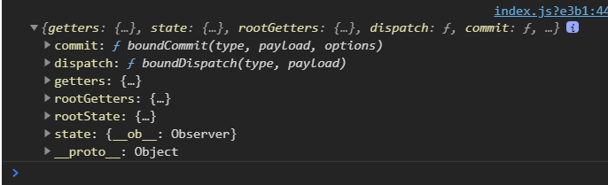

#  Vuex

> Vuex 是一个专为 Vue.js 应用程序开发的状态管理模板。
>
> > 它采用<b>集中式存储管理</b>应用的所有组件的状态，并以相应的规则保证状态以一种可预测的方式发生变化。
> >
> > > 状态管理就是将多个组件共享的变量全部存储在一个对象里，将这个对象放在顶层的 Vue 实例中，让其他组件可以使用。
> > >
> > > > 状态管理一般作用于有共享需求的组件。
> > > >
> > > > > - Vuex 的主要功能选项
> > > > >   - State：存储数据状态。
> > > > >   - Getters：类似组件中的 computed。
> > > > >   - Mutation：处理同步操作。
> > > > >   - Action：处理异步操作。
> > > > >   - Module：

- SPA 管理
- State：状态，类似 Vue 中的 data 等……
- View：视图层，可以针对 State 的变化，渲染不同的信息。
- Actions：用户的操作，如：点击、输入等……


## 一、Vuex 的基本应用以及配置

> Vuex 被 Vue 当作为一个仓库 store ，因此我们在配置 vuex 时，需要对它进行安装：`cnpm install vuex --save` 
>
> > 构建 store 目录，并建立 index.js 文件编写便于管理。在 index.js 文件中导入 Vue 并使其安装 Vuex 插件。
> >
> > > 配置 Vuex 的基本 options 之后将其导出，在 main.js 中获取并将其注册至 Vue 实例当中。
> > >
> > > > 配置完毕后，使用 `$store.state.*` 调用指定属性。

```js
import Vue from 'vue'
import Vuex from 'vuex'

// 安装插件
Vue.use(Vuex)

// 创建对象
const store = new Vuex.Store({
	state: {
		counter: 0
	},
	mutations: {
		
	},
	actions: {
		
	},
	getters: {
		
	},
	modules: {
		
	}
})

// 导出 store 独享
export default store
```

```js
import Vue from 'vue'
import App from './App'
import router from './router'
import store from './store'

Vue.config.productionTip = false

/* eslint-disable no-new */
new Vue({
  el: '#app',
  router,
	// 配置 Vuex 的管理
	store,
  render: h => h(App)
})

```

### 1.1、全局单例模式（大管家）的解释

> 在上一个案例中，我们可以知道 `$store.state.counter` 的属性是共享的，它可以被任何组件直接调用。
>
> > 我们现在要把共享的状态抽取出来，进行统一管理。而后，每个视图按照规定好的规则，进行访问和修改等操作。
> >
> > > Vue 官方公布一个 Devtools 追踪观察数据是由哪个组件发生改变。
> > >
> > > > Mutations 推荐同步操作（Devtools 不支持监听异步操作），当我们需要异步操作时，则在 Actions 中进行。


## 二、vuex-devtools 和 mutations

> vuex-devtools 如图所示，它是监听 Mutations 的工具。Vue 在官方中推荐，我们的同步操作最好经过 Mutations 处理返回。
>
> > 如果 state 的修改不通过 Mutations 那么 devtools 无法监听到状态的改变。
> >
> > > devtools 要监听 mutations ，要在 mutations 中定义方法，对 state 中的值进行监听处理。
> > >
> > > ```js
> > > import Vue from 'vue'
> > > import Vuex from 'vuex'
> > > 
> > > // 安装插件
> > > Vue.use(Vuex)
> > > 
> > > // 创建对象
> > > const store = new Vuex.Store({
> > > 	state: {
> > > 		counter: 0
> > > 	},
> > > 	mutations: {
> > > 		increment(state){
> > > 			state.counter ++
> > > 		},
> > > 		decrement(state){
> > > 			state.counter -- 
> > > 		}
> > > 	},
> > > 	actions: {
> > > 		
> > > 	},
> > > 	getters: {
> > > 		
> > > 	},
> > > 	modules: {
> > > 		
> > > 	}
> > > })
> > > 
> > > // 导出 store 独享
> > > export default store
> > > ```
> > >
> > > > 而后主程序中通过`this.$store.commit('mutations.methods.name')` 来获取
> > > >
> > > > ```vue
> > > > <template>
> > > >   <div id="app">
> > > > 		<h2>{{message}}</h2>
> > > > 		<cpn/>
> > > > 		<h2>{{counter}}</h2>
> > > > 		<button @click="addition">+</button>
> > > > 		<button @click="subtraction">-</button>
> > > >   </div>
> > > > </template>
> > > > 
> > > > <script>
> > > > 	import HelloVuex from './components/HelloVuex.vue'
> > > > export default {
> > > >   name: 'App',
> > > > 	data(){
> > > > 		return{
> > > > 			message: "Hello I'm App Component",
> > > > 			counter: 0
> > > > 		}
> > > > 	},
> > > > 	components:{
> > > > 		cpn: HelloVuex
> > > > 	},
> > > > 	methods:{
> > > > 		addition(){
> > > > 			this.$store.commit('increment')
> > > > 		},
> > > > 		subtraction(){
> > > > 			this.$store.commit('decrement')
> > > > 		}
> > > > 	}
> > > > }
> > > > </script>
> > > > 
> > > > <style>
> > > > </style>
> > > > 
> > > > ```

## 三、Vuex-state 单一状态树（Single Source of  Truth 单一数据源）

> 单一状态指的是即使多元数据要进行划分归类，但依旧使用一个实例对象进行存储。
>
> > 在 Vuex 中的 state 就是如此，Vue 推荐开发者将所有 state 的数据源放入同一个 store 中，而不是放在多个 store 中。

## 四、Vuex-Getters 的基本使用

> Getters 类似组件中的 Computed 选项，它便于我们对数据进行计算处理，这样可以减少我们程序的计算成本。
>
> > Getters 中可以传递 store 中的选项，从而便于我们提取其中所需要的数据（可以调用它本身）。
> >
> > > Getters 可以通过返回函数的形式，来获取组件传递的值。而组件也可以直接对 Getters 进行双向绑定。

```js
import Vue from 'vue'
import Vuex from 'vuex'

// 安装插件
Vue.use(Vuex)

// 创建对象
const store = new Vuex.Store({
	state: {
		counter: 0,
		students: [
			{
				id: 1,
				name: "gzke",
				age: 23
			},
			{
				id: 2,
				name: "mays",
				age: 18
			},
			{
				id: 3,
				name: "gzkemays",
				age: 41
			},
			{
				id: 4,
				name: "fall",
				age: 15
			},
			{
				id: 5,
				name: "cool",
				age: 30
			}
		],
		names: [],
		judgeTag: 0
	},
	mutations: {
		increment(state){
			state.counter ++
		},
		decrement(state){
			state.counter -- 
		}
	},
	actions: {
		
	},
	getters: {
		powerCounter(state){
			return state.counter*state.counter
		},
		student(state){
			return state.students.filter(student => student.age >= state.judgeTag)
		},
		adult(state,getters){
			state.names = getters.student.map(s => s.name)
			return getters.student.length
		},
		judgeAge(state){
             // 绑定函数，从其他组件中获取 age
			return age => state.students.filter(student => student.age >= age)
		}
	},
	modules: {
		
	}
})

// 导出 store 独享
export default store
```

```html
<template>
	<div>
		<h2>{{message}}</h2>
		<h2>{{$store.state.counter}}</h2>
		<h2>{{message2}}</h2>
		<h2>{{$store.getters.powerCounter}}</h2>
		<!-- 通过直接绑定 state judgeTag 来修改 -->
		<input type="number" v-model="$store.state.judgeTag">
		大于{{$store.state.judgeTag}}岁的人数：{{$store.getters.adult}},分别为：
		<span>{{$store.state.names.join(" — ")}}</span>
		<br>
		<!-- 通过绑定 getters 属性函数 -->
		<input type="number" v-model="age">
		大于{{age}}岁的数据：{{$store.getters.judgeAge(age)}}
		<br>

		
	</div>
</template>

<script>
	export default {
		name: "HelloVuex",
		data(){
			return{
				message: "我是 mutations 改变 counter",
				message2: "我是 Getters 计算平方",
				age: 0
			}
		}
	}
</script>

<style>
</style>
```

## 五、mutations 的携带参数

> mutations 主要包括两部分：1、字符串的事件类型（type）2、一个回调函数（handler），该回调函数的第一个参数就是 state。
>
> > 在上面的 mutations 案例中，我们使用的是 mutations 的回调函数。
> >
> > > mutations 指定方法 `name()` ，在组件中调用 `this.$store.commit('name')` 使用方法。
> > >
> > > > 当我们 mutations 中有携带参数，则 `name(data)` 在组件中调用`this.$store.commit('name',data)` 来进行传参。组件中 `data` 称为 `payload(负载)` ，负载可以是一个对象，也可以是一个数值。<b>同时负载的属性名，应该与 mutations 的携带参数名相同。</b>
> > > >
> > > > ```js
> > > > // store -- index.js
> > > > mutations: {
> > > >     // 无参函数
> > > >     increment(state){
> > > >         state.counter ++
> > > >     },
> > > >     decrement(state){
> > > >         state.counter -- 
> > > >     },
> > > >     // 携参函数 
> > > >     addCount(state,count){
> > > >         state.counter += count
> > > >     }
> > > > }
> > > > 
> > > > // App.vue -- script
> > > > methods:{
> > > >      // 调用无参
> > > > 	addition(){
> > > > 		this.$store.commit('increment')
> > > > 	},
> > > > 	subtraction(){
> > > > 		this.$store.commit('decrement')
> > > > 	},
> > > >      // 逗号传参
> > > > 	addCount(count){
> > > > 		this.$store.commit('addCount',count)
> > > > 	}
> > > > }
> > > > ```

## 六、mutations 的提交风格

> commit 是进行提交的一个普通方式，除此之外，Vue 还为其提供了另外一种风格，它是包含一个 `type` 属性的对象。
>
> > 在普通的方式中，我们是通过 `this.$store.commit('name',data)` 来进行传参，但我们调用对象的方式进行封装提交时，`data` 会转换成一个`{type: "name" , data: data_value} ` 的一个对象。<b>传递为对象时，前后不需要一致。</b>
> >
> > ```js
> > addCount(count){
> >     // 风格二：封装 type 进行提交，返回对象。
> >     this.$store.commit({
> >         type: 'addPayload',
> >         count
> >     })
> > }
> > # 返回： {type: "addPayload", count: 10} 的对象。
> > ```
> >
> > ```js
> > addPayload(state,payload){
> > 	// 读取对象，并获取所需要的值。
> >     state.counter += payload.count
> > }
> > ```

## 七、Vuex-Actions 的基本使用

> Actions 主要用于处理异步操作，若 Mutations 是同步函数，则 Actions 属于异步函数。
>
> > 如果在 Mutations 中直接执行异步操作，devtools 是无法进行跟踪的。
> >
> > > 在组件中则通过`this.$store.dispatch(TYPE.UPLOAD_TEACHER_NAME)` 进行调用。

```js
	mutations: {
		[TYPE.UPLOAD_TEACHER_NAME](state){
			// Vue.set(state.teacher,'name','goodmays')
			// setTimeout(()=>{Vue.set(state.teacher,'name','goodmays')},1000)
			// dev-tools 无法进行跟踪
			// setTimeout(()=>{state.teacher.name = "goodmays"},1000)
			 state.teacher.name = "goodmays"
		}
	},
	actions: {
		[TYPE.UPLOAD_TEACHER_NAME](context){
			// 异步操作，调用 mutations 里的方法。
			setTimeout(()=>{context.commit(TYPE.UPLOAD_TEACHER_NAME)},1000)
		}
	}
```

### 7.1、携带参数

> 同样，如果统一的方法，如果没有传参的选项，那么这个方法就显得十分狭窄。因此 actions 也支持传参。
>
> > - `dispatch` 支持两种传参方式
> >
> >   - `this.$store.dispatch(TYPE.UPLOAD_TEACHER_NAME,value)`：逗号分隔传参，actions 直接获取。<b>属性名前后需要一致。</b>
> >
> >     - ```js
> >       actions: {
> >           [TYPE.UPLOAD_TEACHER_NAME](context,name){
> >               // 异步操作，调用 mutations 里的方法。
> >               setTimeout(()=>{context.commit(TYPE.UPLOAD_TEACHER_NAME,name)},1000)
> >           }
> >       }
> >       ```
> >       
> >     - `this.$store.dispatch(TYPE.UPLOAD_TEACHER_NAME,{ name: value , success() => { } })` ：将参数分装成一个对象，同时对象里可以自定义一个函数用于成功后回调。<b>属性名前后不需要一致。</b>
> >     
> >       - ```js
> >         actions: {
> >             [TYPE.UPLOAD_TEACHER_NAME](context,payload){
> >                 // 异步操作，调用 mutations 里的方法。
> >                 setTimeout(()=>{
> >                     context.commit(TYPE.UPLOAD_TEACHER_NAME,payload.name)
> >                     payload.success()
> >                 },1000)
> >             }
> >         }
> >         ```
> >     
> >     - `this.$store.dispatch(TYPE.UPLOAD_TEACHER_NAME,name).then( res => { })`：正常传参后，在 actions 执行异步操作时，返回调用 `Promise` ，actions 执行完毕后，可回调 then 给组件。<b>属性名前后需要一致。</b>
> >     
> >       - ```js
> >         actions: {
> >             [TYPE.UPLOAD_TEACHER_NAME](context,name){
> >                 // 异步操作，调用 mutations 里的方法。
> >                 // setTimeout(()=>{
> >                 // 	context.commit(TYPE.UPLOAD_TEACHER_NAME,payload.name)
> >                 // 	payload.success()
> >                 // },1000)
> >                 return new Promise((resolve,reject) => {
> >                     setTimeout( () => {
> >                         console.log("执行")
> >                         console.log(name)
> >                         context.commit(TYPE.UPLOAD_TEACHER_NAME,name)
> >                         resolve(" I'm resolve! ")
> >                     },1000)
> >                 })
> >             }
> >         }
> >         ```
> >     
> >       - ```js
> >         uploadTeacherName(name){
> >             this.$store
> >             .dispatch(TYPE.UPLOAD_TEACHER_NAME,name)
> >             .then( res => console.log(res))
> >         }
> >         ```

## 八、Vuex-Modules 的基本使用

>在 Vuex 中，我们可以自定义模块当我们某些数据需要独立抽离时候，可以在模块当中自定义`state、mutations、getters、actions` 等选项。
>
>> 在 store 中定义的 modules 后，modules 中的 state 值，是 modules 进行封装后的一个对象并存储在 store 的 state 当中。而 modules 中的 getters 、 mutations 、actions 等，则直接添加到我们的 store 当中。
>>
>> > - 既然都是直接添加到原有的 store 当中，那么为什么说是抽离呢？
>> >
>> >   - 虽然 modules 最终是将其属性添加到对应的 store 选项当中。但是针对 state 的状态，它是属于它本身的。
>> >
>> >   - 如果要获取 store 实例的 state 则需要通过 `第三参数` 来获取。
>> >
>> >     - 所谓第三参数就是（a,b,c），a 获取当前模块的状态，b 获取 store 所有的 getters，c 获取 store 所有的 state （包括本身）。
>> >
>> >     - ```js
>> >       getters: { 
>> >           moduleAwithName(){
>> >               return "I'm moduleA getters"
>> >           },
>> >           moduleAwithName2(state,getters,rootState){
>> >               return state
>> >           }
>> >       }
>> >       ```
>> >
>> >       - 值得注意的是，虽然 `Vue` 调用选项时没有强制命名规范，但是在 actions 的 context 中我们可以知道，`Vue` 已经对它进行一个规范的命名。因此，我们取值时，也应该按照规范来获取。
>> >
>> >     - ```js
>> >       actions: {
>> >           moduleAwithAction(context){
>> >               console.log(context)
>> >           }
>> >       }
>> >       ```
>> >
>> >     - 
>> >     
>> >
>> > > 对于 module 它具有一个“根”的概念，因此在开发过程中，我们可以对个别数据进行划分抽离出来。