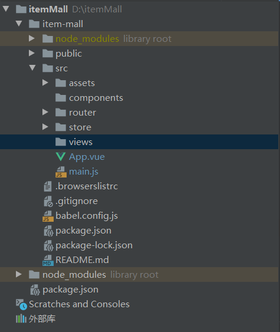

# 商城开发

## 一、目录结构

> components 主要负责存储处理业务的组件，为项目最底层。
>
> > views 主要负责存放视图展示的页面，其中可以调用 components 的组件。

## 二、功能需求

- 后台管理
  - 功能项
    - 轮播图管理
      - 批量管理轮播图 ≤ 6
      - 轮播图的上传应该满足附带已上传商品的 URL
    - 商品管理
      - 支持商品的增删改查的基本入口
      - 商品满足添加并展示首图
      - 商品的增改由模态框做支持
      - 分页系统（可不带页码）
    - 分类管理
      - ~~创建父级分类~~
      - ~~创建子级分类~~
      - 创建分类 `(createTime,typeName)`
    - 网站流量
      - 观察当日流量，存储一周的访问数据。
      - 一个月保存总周长的总流量
    - ~~图库（待考虑）~~
      - ~~存储展示所需图片~~

## 三、 数据库生成类

> 依据功能需求创建所需的类，并根据渲染需求提供相关属性字段。便于数据存储以及获取。

- 轮播图管理（Carousel）
  - 唯一判断值：id
  - 图片名：name
  - 地址存储~~（OSS）~~服务器的 URI（获取路径名即可）：url
  - 轮播图对应的商品 Href：href
  - 创建时间：createTime
  - 更新时间：updateTime
  - 可视化布尔值：is_used
- 商品管理（Product）
  - 唯一判断值：id
  - 商品名：name
  - 负责人：principal
  - 联系方式：contact
  - 期望价格：price
- 隶属分类：type
  - 商品首图（获取路径名即可）：url
  - 商品描述（富文本）：context
  - 创建时间：createTime
  - 更新时间：updateTime
  - 可视化布尔值：is_used
- 分类管理（Type）
  - 唯一判断值：id
  - 分类名：name
  - 创建时间：createTime
  - 更新时间：updateTime
  - 可视化布尔值：is_used
- 流量数据（Visual）
  - 唯一判断值：id
  - 日流量：visual
  - 创建时间：createTime
  - 更新时间：updateTime
  - 可视化布尔值：is_used 

## 问题解决方案

### 一、Axios 传输数据如何转换回 form 表单的 String 类型？

- 方案一：前端将传输的 JSON 数据类型转换为 String 对后端进行单体一对一传输。
  - 应用 `axios` 的 `qs` 库，使用 `qs.stringify(data)` 对数据进行单体转换。
- 方案二：已知 Axios 的传参方式为 JSON，因此后端只需要改成接收 JSON 数据的格式即可。
  - 后端 JAVA：`@RequestBody` 实体类，注意  `@RequestBody` 解析不到参数时，实体类可以用 `@JsonAlias` 或 ·`@JsonProperty` 对参数进行命名。

​	

