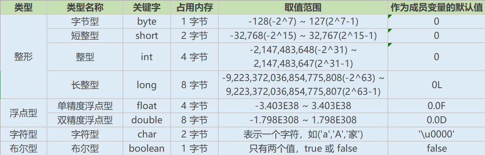

# 基础知识点

> Java 基础知识点，了解 Java 的基本知识从而清楚该语言是用来做什么？能做什么？它的优点是什么？缺点是什么？

## 一、Java 是什么？

> Java 是一门面向对象的编程语言，它吸收了 C++ 的优点同时摈弃了 C++ 中的多继承、指针等抽象的概念。
>
> > Java 具有强大和简单易用的两个特征。
> >
> > > Java 是作为静态面向对象编程语言的代表，极好的实现面向对象理论。

## 二、JVM、JRE、JDK 的关系

- JVM（Java Virtual Machine）：Java 虚拟机，充当 Java 的一个编译平台。在多个系统的环境下，运行 Java 程序都是通过它自己的虚拟机运行实现转码编译的。
- JRE（Java Runtime Environment）：包括了 Java 虚拟机和 Java 的核心类库（java.lang）等……
- JDK（Java Development Kit）：提供 Java 开发人员使用，包含 Java 开发工具以及 JRE。

> 它们关系：JDK 包含 JRE ， JRE 包含 JVM。

## 三、跨平台性

> Java 具有跨平台性，它的原理即是：Java 程序是通过它本身的虚拟机来运行的。

## 四、Java 语言的特点

- 简单易学（语法与 C 和 C++ 接近）
- 面向对象（封装、继承、多态）
- 平台无关系（只通过虚拟机来运行）
- 支持网络编程并且很方便（Java 语言诞生本身就是为了简化网络编程而设计的）
- 支持多线程（多线程机制使应用程序在同一时间可执行多项任务）
- 健壮性（Java 语言的强类型机制、异常处理、垃圾的自动收集等……）

## 五、字节码

> Java 源代码经过虚拟机编译器后产生 (.class) 的文件，它不面向任何特定的处理器，只面向虚拟机。

### 5.1、采用字节码有什么好处呢？

- 字节码具有可移植性，它不专对一台机器，它的编译是通过虚拟机进行解释的。因此它为 Java 实现跨平台提供了便利。
- 字节码具有高效性，一定程度上解决传统的解释型语言执行效率低的问题。

### 5.2、Java 是如何调用字节码？

> 字节码是 Java 源代码通过编译器后形成的，它是不被计算机所识别。因此它需要一个解释器，将字节码解释为计算机语言（二进制码）。

- ` Java 源代码 -> 编译器 -> JVM 可执行的 Java 字节码 -> JVM -> 解释器 -> 机器可执行的二进制码`
  - Java 在机器和应用程序之间加入了一层 JVM（虚拟机）。
    - 因此编译程序实际上面向的是虚拟机。
      - 虚拟机执行 Java 编译器返回过来的字节码。
  - 但是我们实际应用上是要将我们的编译程序交由机器来运行的。
    - 因此 JVM 提供了一个解释器充当（翻译）的作用。
      - 解释器可以翻译成不同机器所对应的二进制码，从而可以让机器来运行。

## 六、Java 程序的主类

> 一个程序中可以有多个类，但是有且只有一个主类（Main）。而主类则是作为一个程序的入口，用于调用实现的逻辑。

### 6.1、应用程序和小程序的主类有何不同？

- 应用程序：主类不一定是 public 类。
- 小程序：主类一定是 public 类，它是继承系统类 JApplet 或 Applet 的子类。

#### 6.1.1、它们之间的差别是什么？

- 应用程序：从主线程启动（main 方法）。
- 小程序：Applet 没有 main 方法，主要是嵌在浏览器页面上运行（调用 init 线程或者 run 启动），与 flash 小游戏类似。

## 七、Java 和 C++ 的区别

- 都是面向对象的语言，都支持封装、继承和多态。
- Java不提供指针来直接访问内存，程序内存更加安全。
- Java的类是单继承的，C++支持多重继承；虽然Java的类不可以多继承，但是接口可以多继承。
- Java有自动内存管理机制，不需要程序员手动释放无用内存。

## 八、Oracle JDK 和 OpenJDK 的对比

- Oracle JDK版本将每三年发布一次，而OpenJDK版本每三个月发布一次；
- OpenJDK 是一个参考模型并且是完全开源的，而Oracle JDK是OpenJDK的一个实现，并不是完全开源的；
- Oracle JDK 比 OpenJDK 更稳定。OpenJDK和Oracle JDK的代码几乎相同，但Oracle JDK有更多的类和一些错误修复。因此，如果您想开发企业/商业软件，我建议您选择Oracle JDK，因为它经过了彻底的测试和稳定。某些情况下，有些人提到在使用OpenJDK 可能会遇到了许多应用程序崩溃的问题，但是，只需切换到Oracle JDK就可以解决问题；
- 在响应性和JVM性能方面，Oracle JDK与OpenJDK相比提供了更好的性能；
- Oracle JDK不会为即将发布的版本提供长期支持，用户每次都必须通过更新到最新版本获得支持来获取最新版本；
- Oracle JDK根据二进制代码许可协议获得许可，而OpenJDK根据GPL v2许可获得许可。

# 基础语法

## 一、基本数据类型

- 数值型
  - 整数型：byte、short、int、long
  - 浮点型：double、float
- 字符型：char
- 布尔型：boolean

## 二、引用数据的类型

- 数据是被为了被调用而存在的，而 Java 提供了多种调用的方式。
  - 基本类（class）
  - 接口（interface）
  - 数组（[ ]）



## 三、switch（express） 能够作用的数据类型

> switch 类似 for 循环，用于作用根据条件进行循环。

- Java 5 以前，express：byte、short、char、int
- Java 5 开始：引用了枚举型，express 也可以是 enumerate 类型。
- Java 7 开始：express 可以是字符串（String）类型
- <b>long 类型始终不可以。</b>

## 四、Math.round

> Math.round 是对数据进行四舍五入的取整。

- 对于正数：Math.round(11.5) = 12，+0.5
- 对于负数：Math.round(-11.5) = 11，+0.5

<b>始终贯穿入加舍去的原则</b>

## 五、下转型（窄化 down-casting）的精度损失

> 已知每个数据它的精度是不一样的，如 int 是整数型，它不能精确到小数点，而 Double 是浮点型能精确至小数点后 n 位。因此当 Double 转换成 Int 时，它的精度下降，这过程称为下转型。
>
> > 当 Double a = 2.3 * 100 (230) 时，如果直接对其进行数据强行转换成 Int（int i = new Double（a) 则会发生精度丢失。

```java
package dataAcqusition;
public class accuracyLoss {
	/**
	 * 精度丢失
	 */
	public static void main(String[] args) {
		// 向下转型的精度丢失问题
		double a = 5.6;
		// 理论上应当进行四舍五入, int b = 6,但由于直接强制转换从而精度发生丢失.b = 5
		Integer b = Integer.valueOf((int)a);
         // 根据理论来,先将 a 进行手动四舍五入后再进行整数型之间的类型转换.防止精度丢失.
		Integer c = Integer.valueOf((int) Math.round(a));
		System.out.println(b);
	    System.out.println(c);	
		
	}
}
```

- 精度级别：byte(1B) ＜ short(2B) ＜ int(4B)  ≤  float(4B)＜ long(8B) ≤ double(8B) （char ＜ int） 
  - 整数型 ＜ 浮点型

### 5.1、Double 和 Float 都可以自带小数，它们精度有什么不同？

```java
float d = (float)5/3;
double e = (double)5/3;
```

> 在该案例中，5/3 是无限循环小数，等于 1.66666……7。
>
> > 对于 float 而言，它只取多数结果（6），因此 d = 1.6666666；
> >
> > 对于 double 而言，它结尾四舍五入取（7），因此 e = 1.6666666666666667；
> >
> > > 这是它们的精度的区别。

### 5.2、精度涉及到了数据类型，它们需要注意什么？

> Java 是一种强类型语言，它明确了语言之间的区别。坚持装苹果的篮子只能有苹果的原则。
>
> > 但是它们却又有等级之分，假设（A部门级别 < B 部门级别）：只有 1 年工作经验的程序员，他能力有限因此去不了 B。但是有 15 年工作经验的程序员可以去 B 也可以去 A。
> >
> > > 因此在处理数据时，我们不仅需要考虑它们的数据类型，还应当考虑它们的级别。

```java
package dataAcqusition;
public class strongLang {
	/**
	 * 强类型语言
	 */
	public static void main(String[] args) {
		// int < long
		int a = 5;
		long b = 6;
		// 报错,提示 b 必须向下转型为 int 类型
		a = a + b;
		// 可以执行
		b = a + b;
	}
}
```

### 5.3、a = a + 1 和 a +=1 之间的区别是什么？

> 已知 a+=1 就是 a 进行加一运算，那么我们已经知道精度的问题之后，我们可以思考下，当 `short` 类型进行 +1 运算时能否直接运行？

```java
short a = 5;
// 无法执行, int > short
a = a + 1;
// 可以执行.
a += 1;
System.out.println(c);
```

- 上述案例中出现如此情况，因此我们可以知道， a+=1 肯定不只是单纯的执行加一运算，而是涉及到了数据类型转换。
  - `a += 1 ` 等于 `a = (short)(a + 1) `

## 六、注释

> 增加代码可读性，在处理逻辑运算过程中，可以有效的提高阅读效率。
>
> > <b>多行注释和文档注释，不能嵌套使用。</b>

- 单行注释
  - 格式： // 注释文字
- 多行注释
  - 格式： /* 注释文字 */
- 文档注释
  - 格式：/** 注释文字 */

## 七、访问修饰符

> 已知，在 Java 中常量的数据类型具有级别之分。那么类、方法、变量也应当有级别之分。
>
> > 访问修饰符可以有效的定义<b>类、方法、变量</b>它们的访问权限从而对它们进行访问保护。

- private（私有的）：只能在同一类的可见，其他包不可见。
- default（默认的，当缺省不指定声明则调用。）：在同包、同类中可见，其他包不可见。
- protected（受保护的）：在同包、同类、子类中可见，其他包不可见。
- public（公开的）：在其他包、同包、同类、子类中可见。

## 八、运算符

> 运算符有分<b>按位与</b>和<b>逻辑与</b>，它们主要作用于多条件的并行判断。
>
> > 按位与：单符号表示，逻辑与：双符号表示。
> >
> > > - & 和 &&（当条件都为 true 时执行）
> > >   - a & b ：判断 a 条件后继续判断 b 条件。
> > >   - a && b ：判断 a 条件后如果为 false 则不判断 b 条件。
> > > - | 和 || （当条件之一为 true 时执行）
> > >   - a | b：判断 a 条件成立后继续判断 b 条件。
> > >   - a || b：判断 a 条件成立后不再判断 b 条件。
> > >
> > > > 按位与：它不会形成短路，而是并通。与并联电路类似。
> > > >
> > > > 逻辑与：条件的成立与否会决定电路是否短路。与串联电路类似。

## 九、final 的作用

> final 用于修饰类、属性和方法。用于定义该方法或类或属性的最终形态。

- 被 final 修饰的类不可以被继承。
- 被 final 修饰的属性不可以被直接修改，但是可以修改属性的内容。
- 被 final 修饰的方法不可以被重写。

### 9.1、final、finally、finalize 的区别

- final：修饰的类不可被继承、修饰属性的引用不可被修改，但指向属性的内容可修改、修饰的方法不可被重写。
- finally：一般以 `try{ }catch{ }finally{ }` 的形式体现，用于定义最终执行的逻辑llk运算。`catch` 异常不会影响 `finally` 的执行。
- finalize：属于 Object 类的一个方法，而 Object 类为所有类的父类，因此该方法一般被用于垃圾回收器调用。当我们调用 `System.gc()` 时，由垃圾回收器调用 `finalize()`，一个对象是否可回收的最后判断。

## 十、this 和 super 关键字

### 10.1、this 关键字

> 开发中我们经常用到 this，那么 this 指的是什么？
>
> > this 指的是当前所属类的一个方法或一个函数亦或者是一个变量，而不是指定它们的本身。

```java
package dataAcqusition;

public class thisAndSuper {
	private String name;
    
	public String getName() {
		return name;
	}	
    
	public void thisAndSuper(String name){
         // this.name 指向 thisAndSuper 的 name.
		this.name = name;
	}
	
	public static void main(String[] args) {
		thisAndSuper tas = new thisAndSuper();
		tas.thisAndSuper("hwy");
         // 输出 hwy
		System.out.println(tas.getName());
		
	}
}

```

### 10.2、super 关键字

> super 调用的是父类的属性、方法。

```java
public static class person {
	private String name;
	private Integer age;
	
	public person(String name, Integer age) {
		this.name = name;
		this.age = age;
	}
}
// 声明 student 类的父类是 person
public static class student extends person {
	private String idCard;
	
	public student(String name, Integer age, String idCard) {
         // 在父类中查找构造函数并调用传值
		super(name, age);
		this.idCard = idCard;
	}
	
	public void getInfo(){
         // 在父类中查找 name
		System.out.println(super.name);
		System.out.println(this.idCard);
	}
}

	public static void main(String[] args) {
		thisAndSuper tas = new thisAndSuper();
		student s = new student("mays",23,"123");
		s.getInfo();		
	}
```

## 十一、static 存在的意义

### 11.1、在数据层面上的作用

> static 表明为静态方法，它存在的意义在于创建独立于具体对象的域或者方法。
>
> > 即使没有创建对象，也能使用属性和方法。

```java
package dataAcqusition;

import java.util.HashMap;
import java.util.Map;

public class staticTest {
	private static final String name = "123";
	private static final Map info = new HashMap();
	
	
	public String testStatic(String name){
		// 不需要实例化对象就可以直接调用
		// 复习内容：final 定义的对象不可直接被修改,但是可以修改它里面的内容
		info.put("name", name);
		System.out.println(info);
		// 当有同名属性时,可以通过 this 来直接指明该类中的  name
		return this.name;
	}
	
	/**
	 * static 的使用
	 */
	public static void main(String[] args) {
		staticTest st = new staticTest();
		System.out.println(st.testStatic("567"));
	}

}

```

### 11.2、在性能优化上的作用

> static 可以用来形成静态代码块以优化程序性能。它可以置身于程序中的任何一个地方，类中可以有多个 static 块。
>
> > 当类初次被加载时，会按照 static 块的顺序来执行，并且只会执行一次。
> >
> > > 由于 static 有该特性，因此在程序中许多只执行一次的代码都会以 static 的形式去进行。
> > >
> > > > static 变量值在类的加载时候分配空间，以后创建类对象的时候不会重新分配。

### 11.3、static 的作用场景

> 如有有一个成员是应当<b>被所有对象共享的，那么这个成员变量就应该定义为静态变量。</b>

- 修饰成员变量
- 修饰成员方法
- 静态代码块
- 修饰类【只能修饰内部类】
- 静态导包

### 11.4、static 作用域

> static 只能静态访问，非静态的既可以访问静态的，也可以访问非静态的。
>
> > 但是静态的不能访问动态的。(static 表明的成员不能访问无 static 声明的成员)

## 十二、流程控制语句

### 12.1、break、continue、return 的区别及作用

- break：作用于循环的跳出，当循环执行至 break 时停止循环。
- continue：作用于跳出本次循环，当循环执行至 continue 时则跳过直接进行下次循环。
- return：不再执行往后的代码，当循环执行至 return 时则返回 return ，返回的对象可以是变量也可以是方法。

```java
package dataAcqusition;

public class cycleTest {
	private static int num = 50;
	
	private void breakCycle(int i){
		for (int j = 0; j < i; j++){
			if ( j == 2){
				break;	
			}
			System.out.println(j);
		}
	}
	
	private void continueCycle(int i){
		for (int j = 0; j < i; j++){
			if ( j == 2){
				continue;
			}
			System.out.println(j);
		}
	}
	
	private int Cooperate(int i){
		return i+2;
	}
	
	private int returnCycle(int i){
		for (int j = 0; j < i; j++){
			if ( j == 2){
				return this.Cooperate(j);
			}
		}
		return 0;
	}
	
	/**
	 * 循环的跳出
	 */
	public static void main(String[] args) {
		// TODO Auto-generated method stub
		cycleTest ct = new cycleTest();
		ct.breakCycle(num);
		ct.continueCycle(num);
		System.out.println(ct.returnCycle(num));
	}
}
```

### 12.2、跳出多重嵌套循环

> 所谓多重嵌套循环，就是一个循环中再嵌套了一个循环。如果我们要在内层跳出，则只需要为该嵌套循环定义一个 `target`。
>
> > 当需要跳出该嵌套循环时，`break target` 即可。

```java
// 定义 ok 为该嵌套循环的 target
ok:
    for(int i = 0; i < 10; i++){
        for(int j = 0; j < 10; j++){
            System.out.println("i="+ i +",j="+ j);
            if(j==5){
                // 循环执行至此时,跳出 target 为 ok 的循环.
                break ok;
            }
        }
    }
```

# 面向对象

## 一、面向对象和面向过程的区别

- 面向对象：它是模型化的，只需要抽象的提取出解决方法、需求的一个类直接调用即可。
  - 优点：<b>易维护、易复用、易扩展</b>。由于面向对象有封装、继承、多态的特性，可以设计出低耦合的系统，使系统更加灵活、更加易维护。
  - 缺点：性能比面向过程低。
- 面向过程：它是具体化、流程化的。解决一个问题需要通过什么步骤，什么流程，是一步一步实现的。
  - 优点：性能高，因为类的调用需要实例化，开销比较大，比较消耗资源。
  - 缺点：没有面向对象一样具有易维护、易复用、易扩展的特性。

> <b>面向对象的底层依旧是面向过程</b>，就如我们写个接口的实现，接口被直接调用时就是面向对象。而我们在编写接口的业务逻辑时则是面向过程。
>
> > 面向对象是面向过程的封装。

## 二、面向对象的三大特性

> 面向对象的特性主要有以下几个方面
>
> > 面向对象有个特点，就是它是抽象的。
> >
> > - 抽象
> >   - 将一类对象的共同特征总结出来构造类的过程，包括数据抽象和行为抽象两方面。
> >   - 抽象只关注对象有哪些行为和属性，不关注行为的细节是什么。

- 封装
  - 将一个对象属性私有化，同时提供一些可以被外界访问的属性方法。
  - 一般类是公开的，但是类的属性、方法是封闭的，其他不能直接调用修改的。
- 继承
  - 继承父类的所有方法以及属性，从而便于我们对父类的原始功能进行扩展。
  - 不能选择性的继承父类。
- 多态
  - 类的实现是交由程序运行期间的需求来决定的编程时并不确定。父类或接口定义的引用变量可以指向子类或具体实现类的实例对象，提高程序拓展性。
  - 多态就是指编程时调用封装方法的不确定性。
  - Java 中实现多态的方法：继承（多个子类对同一个方法的重写）和接口（实现接口并覆盖接口中的方法）。

### 2.1、关于继承的细节

- 继承是可以调用父类的所有属性和方法吗？
  - 不是的，子类拥有的只是父类的非 private 的属性和方法。
- 子类只能调用父类的父类的方法吗？
  - 不是的，继承具有可扩展性，当子类调用父类时，可以对父类的方法进行扩展。
- 那么，子类只能照着父类的原则来进行修改吗？
  - 不是的，方法是可以重写的，当需求需要子类以其他形式定义时，子类可以用自己的方式来实现父类的方法。

### 2.2、什么是多态机制？Java 是如何实现的？

- 多态机制
  - 所谓多态就是程序中定义的引用变量所指向的具体类型和通过引用变量发出方法调用在编程时并不确定，而是在程序运行期间才确定。
  - 即一个引用变量到底会指向哪个类的对象，该引用对象发出的方法调用到底是哪个类中实现的方法，必须由程序运行期间才能决定。
  - 因为在程序运行时，程序才知道需要引用的是哪个类。如此下来，<b>一个变量绑定到不同类的实现中时，它的变化也不同</b>，这样就可以达到不修改程序代码就可以改变运行时所绑定的具体代码（所传递的参数），从而实现多态。
- 多态分为编译时多态和运行时多态
  - 编译时多态：指编译时是静态的，主要指方法的重载，它是根据不同的重载方法来决定参数的变化。但它并不属于真正的多态。
  - 运行时多态：运行时多态是动态的，它是通过动态绑定来实现的，也就是我们所指的多态性。
- Java 是如何实现多态的？
  - Java 实现多态必须满足三个条件
    - 继承：在多态中必须存在有继承关系的子类和父类。
    - 重写：子类对父类中某些方法进行重新定义，在调用时则调用子类重写后的方法。
    - 向上转型：在多态中需要将子类引用赋给父类对象，只有这样该引用才能具备技能调用父类的方法和子类的方法。
  - 满足三个条件时，我们才能够在同一个继承结构中使用统一的逻辑实现代码处理不同的对象，从而达到不同的行为。

> <b>多态机制实现的原则：一个方法的执行，它是对一个超类方法的重写。</b>
>
> > 以接口为例，在程序中我调用该接口，它本身是不具备任何方法的。它只提供一个方法名和所需的参数类型。
> >
> > > 但是当我们对该接口的方法进行继承并重写 (impl) 后发生向上转型，那么该接口就拥有了业务逻辑。
> > >
> > > > 此时调用该接口时，就相当于调用接口的子类 (impl)，从而实现多态。

# 接口和类

> 上述的诸多地方提到过接口和类，那么接口和类到底是什么？

## 一、抽象类和接口的对比

> 抽象类是用来捕获通用特性的，接口是抽象方法的集合。
>
> > 以开发规范而言，抽象类是对类的抽象，是一种设计模板。而接口则是行为的抽象，是一种行为规范。

- 共同点
  - 接口和抽象类都不能被实例化。
  - 都位于继承的最顶端，用于被其他类的继承或实现。
  - 都包含抽象方法，其子类必须复写该方法。

- 不同点

|    参数    |                            抽象类                            |                             接口                             |
| :--------: | :----------------------------------------------------------: | :----------------------------------------------------------: |
|    声明    |                  使用 abstract 关键字声明。                  |                 使用 interface 关键字声明。                  |
|    实现    | 子类通过 extends 关键字来继承抽象类 <br>如果子类不是抽象类它需要提供抽象类中所有方法的实现。 | 子类通过 implements 关键字来继承接口<br>它需要提供接口中所有方法的实现。 |
|   构造器   |                    抽象类可以拥有构造器。                    |                     接口不能拥有构造器。                     |
| 访问修饰符 |                 抽象类可以是任意访问修饰符。                 |                       只能是 public。                        |
|   多继承   |                  一个类最多继承一个抽象类。                  |                   一个类可以实现多个接口。                   |
|  字段声明  |                 抽象类声明字段可以是任意的。                 |           接口声明字段必须是 static 和 final 的。            |

> 在 Java8 中接口引入了默认方法 default 和静态方法，以此来减少抽象类和接口之间的差异。

- 在选择抽象类和接口时，必须遵守以下原则。
  - 行为模式总是通过接口来完成的而不是由抽象类定义的。所以通常优先使用接口而不是抽象类。
  - 选择抽象类时通常是由于需要定义子类的行为，又要为子类提供功能。

## 二、抽象类为什么不能被 final 修饰？

​	定义抽象类的目的在于让子类继承从而对它进行拓展，如果使用 final 修饰那么就说明该抽象类的方法是不可被重写的。那么它的存在就失去了意义。

## 三、创建一个对象用什么关键字？对象实例和对象引用有什么不同？

- 对象的实例：对象通过 new 关键字进行实例化从而将对象存放在堆内存中。
- 对象的引用：指的是指向对象实例（堆内存中的对象）。

>  <b>一个对象的引用可以指向 0 或 1 个对象，而一个对象可以拥有多个对象的引用。</b>
>
> > 如：一根绳子可以绑一个气球也可以不绑。但一个气球可以被 n 多个绳子绑住。

# 变量与方法

- 变量：在程序执行的过程中，在某个范围内其值可以发生改变的量。从本质上来讲，变量其实就是内存中的一小块区域。
- 成员变量：方法外部，类内部定义的变量。
- 局部变量：类的方法中定义的变量。

|   范围   |                        成员变量                        |                         局部变量                         |
| :------: | :----------------------------------------------------: | :------------------------------------------------------: |
|  作用域  |                    针对整个类有效。                    |                     只针对方法有效。                     |
| 存储位置 | 随着对象的创建而存在，销毁而消失。<br>存储在堆内存中。 | 方法调用时存在，调用后消失自动释放。<br>存储在栈内存中。 |
| 生命周期 |           随着对象的创建而创建，消失而消失。           |             方法调用时创建，调用后自动释放。             |
|  初始值  |                       有默认值。                       |              没有默认值，但使用前必须赋值。              |

> <b> 原则以就近为原则，现在局部中寻找变量，有就使用；接着在成员位置中找。</b>

## 一、在 Java 中我们定义一个类时，经常会有一个无参的构造函数，那么它的作用是什么？

​	Java 程序在执行子类的构造方法前，如果没有 super() 来调用父类特定的构造方法，则会调用父类的无参构造函数。所以，如果父类中只定义了有参的构造函数，那么当子类没有调用 super() 来调用父类的特定方法时，则编译会发生错误。
​	所以为了避免子类找不到无参的构造函数，可以在父类中构建一个无参的构造函数。

## 二、调用子类构造方法之前会先调用父类没有参数的构造方法，其目的是？

​	为了便于子类的初始化工作。

## 三、一个类的构造方法的作用是什么？若一个类没有声明构造方法，改程序能正确执行吗？为什么？

​	主要作用是帮助子类的初始化。如果没有声明可以执行，因为一个类即使没有声明构造方法也会有默认的不带参数的构造方法。

## 四、构造方法有哪些特征？

- 方法名与类名相同。
- 没有返回值，不能用 void 声明构造函数。
- 生成类的对象时自动执行，无需调用。

## 五、静态变量和实例变量的区别

- 静态变量
  - 不属于任何实例对象，属于类的，所以在内存中只会有一份，在类的加载过程中，JVM 只会静态变量分配一次内存空间。
- 实例变量
  - 每次创建对象，都会为每个对象分配成员变量内存空间。实例变量是属于实例对象的，在内存中，创建几次对象，就有几份成员变量。

## 六、静态方法和实例方法有什么不同？

- 静态方法
  - 静态方法可以直接以：`静态方法名.属性` 和 `对象名.方法名` 的方法调用，无需创建对象。
  - 静态方法只能访问静态的方法和成员。
  - 静态方法可以不通过对象进行调用，因此静态方法里，不能调用其他非静态变量，也不可以访问其他非静态变量成员。
- 实例方法
  - 实例方法只能以：`对象名.方法名` 的方法调用，需要创建对象。
  - 实例方法可以调用静态方法成员也可以调用动态方法成员。

## 七、什么是方法的返回值？返回值的作用是什么？

​	一个方法定义了某个数据类型时，则表明该方法必须返回该类型的数据。当该方法达到某个条件时，return 返回的值叫作方法的返回值。

​	返回值的作用在于执行该方法后获得所需要的数据，便于再利用。

# 内部类

## 一、什么是内部类？

> 在 Java 中，可以将一个类的定义放在另一个类的定义的内部，则称之为内部类。内部类本身就是类的一个属性，与其他属性定义方式一致。
>
> > 内部类可以分为四种
> >
> > - 成员内部类
> >
> >   - 定义在成员类的内部，可以调用静态变量以及动态变量。
> >
> >   - ```java
> >     package classInstructions;
> >     
> >     public class staticInnerClass {
> >     	private static String info = "我是外部静态属性";
> >     	private String dInfo = "我是外部动态属性";
> >     	// 成员内部类
> >     	class DynamicInner{
> >     		public void info(){
> >     			System.out.println("输出成员内部类的调用静态的信息:"+info);
> >     			System.out.println("输出成员内部类的调用动态的信息:"+dInfo);
> >     		}
> >     	}
> >     
> >     	public static void main(String[] args) {
> >     		staticInnerClass sic = new staticInnerClass();
> >     		DynamicInner di = sic.new DynamicInner();
> >     		di.info();
> >     	}
> >     }
> >     
> >     ```
> >
> > - 局部内部类
> >
> >   - 定义在局部方法中，它可以访问外部类的所有变量和方法。它的实例化只能在方法中进行。
> >
> >   - 定义 String 类型时应该直接定义最终形态，否则不能被调用。
> >
> >   - <b>若定义的内部类为静态类时，则不能调用外部的动态信息。</b>
> >
> >   - ```java
> >     package classInstructions;
> >     
> >     public class staticInnerClass {
> >     	private static String info = "我是外部静态属性";
> >     	private String dInfo = "我是外部动态属性";
> >         
> >     	// 局部内部类
> >     	public void LocalInner(){
> >     		final String a = "我是方法中定义的变量";
> >     		class LocalInnerClass{
> >     			public void info(){
> >     				System.out.println("输出成员内部类的调用静态的信息:"+info);
> >     				System.out.println("输出成员内部类的调用动态的信息:"+dInfo);
> >     				System.out.println("输出成员内部类的调用动态的信息:"+a);
> >     			}
> >     		}
> >     		LocalInnerClass lic = new LocalInnerClass();
> >     		lic.info();
> >     	}
> >     	public static void main(String[] args) {
> >     		staticInnerClass sic = new staticInnerClass();	
> >     		sic.LocalInner();
> >     	}
> >     
> >     }
> >     
> >     ```
> >
> > - 匿名内部类
> >
> >   - 一个没有名字的类，但是它必须继承或实现一个已有的接口。
> >
> >   - 匿名内部类中不能定义任何静态成员和静态方法。
> >
> >   - 当所在的方法形参需要被匿名内部类使用时，必须声明为 final。
> >
> >   - 匿名内部类不是抽象的，它必须要实现继承或者实现接口的所有抽象方法。
> >
> >   - ```java
> >     package classInstructions;
> >     
> >     public class staticInnerClass {
> >     	private static String info = "我是外部静态属性";
> >         
> >     	private String dInfo = "我是外部动态属性";
> >     	// 创建接口
> >     	interface Service{
> >     		void SearchUserInfo();
> >     	}
> >     	
> >     	// 匿名内部类
> >     	public void AnonymousInner(){
> >     		final int a = 5;
> >     		new Service(){
> >     			@Override
> >     			public void SearchUserInfo() {
> >     				System.out.println("我是匿名内部类"+info);
> >     				System.out.println("我是匿名内部类"+dInfo);
> >     				System.out.println("我是匿名内部类"+a);	
> >     			}		
> >     		}.SearchUserInfo();
> >     	}
> >     	public static void main(String[] args) {
> >     		staticInnerClass sic = new staticInnerClass();
> >     		sic.AnonymousInner();
> >     	}
> >     }
> >     ```
> >
> > - 静态内部类
> >
> >   - 定义在静态类中，可以访问外部类所有的静态变量，而不可以访问外部类的非静态变量。
> >
> >   - ```java
> >     package classInstructions;
> >     
> >     public class staticInnerClass {
> >     	private static String info = "我是外部静态属性";
> >     	static class StaticInner{
> >     		public void info(){
> >     			System.out.println("输出静态内部类的信息:"+info);
> >     		}
> >     	}
> >     
> >     	public static void main(String[] args) {
> >     		// TODO Auto-generated method stub
> >     		StaticInner si = new staticInnerClass.StaticInner();
> >     		si.info();
> >     	}
> >     }
> >     ```

## 二、内部类的优点

- 一个内部类对象可以访问外部类的对象内容，包括私有数据。
- 内部类不为同一个包的其他类所见，具有很好的封装性。
- 内部类有效实现了“多重继承”，优化 Java 单继承的缺陷。
- 匿名内部类可以很方便的定义回调。

## 三、内部类的使用场景

- 一些多算法的场合
- 解决一些非面向对象的语句块。
- 适当使用内部类，使得代码更加灵活和富有扩展性。
- 当某个类除了它的外部类，不再被其他类使用时。

## 四、局部内部类和匿名内部类访问局部变量时，为什么要加上 final？

​	因为生命周期不一致，局部变量时存储在栈内存中，当方法执行结束时，非 final 的变量就会被销毁。而局部内部类对于局部变量的引用依然存在。如果不加 final 则变量就无法被内部类调用。

# 重写和重载

- 重载（ Overload ）：发生在同一个类中，方法名相同但参数不同（参数类型、个数、顺序）。

  - 与方法返回值修饰符无关，即重载的方法不能根据返回类型进行区分。

  - ```java
    public class function {
    	// 定义一个方法
    	public void test(int i){
    		System.out.println(i);
    	}
    	// 类型不同
    	public void test(String i){
    		System.out.println(i);
    	}
    	// 个数不同
    	public void test(int i, String j){
    		System.out.println(j+"say:"+i);
    	}
    	// 顺序不同
    	public void test(String i, int j ){
    		System.out.println(i+"say:"+j);
    	}
    }
    ```

- 重写（ Overried ）：发生在子类继承父类或接口时，它必须重写父类或接口的所有方法。

  - 其方法名、参数个数及类型必须相同。
  - 返回值 ≤ 父类，抛出异常 ≤ 父类，访问修饰符 ≥ 父类（里氏代换原则）。
  - 如果父类方法访问修饰符为 private 则子类就不是重写。

# 对象相等判断

> 所谓对象相等是判断，就是判断地址或者数值是否相等。

- == ： 用于判断两个值的地址是否相等，即判断两个对象是否为同一对象。

  - ```java
    int a = 5;
    int b = 5;
    // a == b 为  true
    ```

  - ```java
    Integer a = new Integer(5);
    Integer b = new Integer(5);
    // a==b 为 false
    ```

- equals( )：用于判断两个对象是否相同，但与 `==` 不同的是当类覆盖了 equals( ) 方式时，它只是对值进行比较，不会去判断地址。

  - ```java
    String c = new String("5");
    String d = "5";
    // c.equals(d) 为 true
    ```

    - String 中的 equals 方法是被重写过的，因为 Object 的 equals 方法是比较的对象的地址（和 `==` 相同），而 String 的 equals 方法比较的是对象的值。
    - 当创建 String 类型的对象时，虚拟机会在常量池中查找有没有已经存在的值和要创建的值相同的对象。如果有就会把它赋给当前引用，如果没有就在常量池中重新创建一个 String 对象。

## 一、<font color ='red'>HashCode 和 equals</font>

### 1.1、HashSet 如何检查重复？

#### 1.1.1、什么是 hashCode？

> 所谓 hashCode 就是哈希值，也称为散列码。它实际上是返回一个 int 整数。这个哈希码的作用是确定该对象在哈希表中的索引位置。hashCode( ) 定义在 JDK 的 Object.java 中，这意味着任何类都包含 hashCode( ) 函数。
>
> > 散列表的存储是(key - value)，它的特点是：能根据 “键” 快速的检索出对应的 “值”。这其中就利用了散列码。

#### 1.1.2、为什么要有 hashCode？

> 当把对象加入 hashSet( ) 时，hashSet( ) 会根据 hashCode( ) 的哈希值来判断插入的位置。
>
> > 同时它会与其他哈希值来作比较，来检查是否已经存在相同的哈希值。如果没有相同的，则 hashSet( ) 会先假设对象没有重复出现。
> >
> > > 但是如果有相同的哈希值存在时，hashSet( ) 会调用 equals 方法来检查 hasCode 是否真的相等。如果真的相等则不会进行插入操作，如果不同的话则会重新散列加入至其他位置。
> > >
> > > > 如此便减少了 equals 的调用次数，提高执行速度。

### 1.2、hashCode( ) 和 equals( ) 的相关规定

- 如果两个对象相等，则 hashCode 一定也是相同的。

- 两个对象相等，对两个对象分别调用 equals 方法都返回 true。

- 两个对象有相同的 hashCode 值，它们也不一定相等。

  - ```java
    String str1 = "通话";
    String str2 = "重地";
    
    int a = str1.hashCode();
    int b = str2.hashCode();
    
    // a = b
    ```

> 因此，<b>equals 方法被覆盖过，则 hashCode( ) 方法也必须被覆盖。</b>
>
> > hashCode( ) 的默认行为是对堆上的对象产生独特值。如果没有重写 hashCode( )，则该 class 的两个对象无论如何都不会相等。（即使两个对象指向相同的数据）

## 二、对象相等与指向它们的引用相等，有什么不同？

- 对象相等：比的是内存中存放的内容是否相等。
- 地址相等：比的是它们指向的内存地址是否相等。

# 值传递

## 一、一个方法调用一个对象，此方法可以改变该对象的属性，并返回结果，那么是值传递还是引用传递？

> Java 中方法调用只支持参数的值传递。
>
> > 当一个对象实例作为一个参数传递到方法时，才是引用传递。

- 值传递：一个方法传入的参数为之值传递，无论方法如何改变该参数的值，参数本身是不会受到影响的。
  - 它传递的参数是按值的拷贝传递，传递的值是拷贝的。
  - 例如：传入简单的 int、String 等，变化只会在方法中生效。
- 引用传递：一个对象实例作为参数进行传递时为之引用传递，方法对其的改变会影响参数本身。
  - 它传递的是引用的地址。
  - 例如：传入 Array、Map 等，变化在方法中生效时，它们的本身也会受影响。

 Java 对象采用不是采用引用调用，实际上，对象引用也是按值传递的。

- 一个方法不能修改一个基本数据类型的参数。
- 一个方法可以改变一个对象参数的状态。
- 一个方法不能让对象参数引用一个新的对象。

# Java 包

## 一、JDK 中常用的包有哪些？

- java.lang：Java 的系统基础类。
- java.io：所有输入输出有关的类，比如文件操作等……
- java.sql：数据库类。
- java.util：基础的系统辅助类，特别是集合类。
- java.nio：为了完善 IO 包中的功能，提高 IO 包中性能的一个新包。
- java.net：与网络有关的包

## 二、java 和 javax 有什么区别？

​	javax 是被当做扩展包来使用的，随着时间的推移，javax 逐渐成为主流，如果扩展从 javax 变成 java 实在太麻烦了并且可能会破坏一些已有的代码。因此最终将 javax 包变成标准 API 的一部分。

​	实际上 Java 和 Javax 是一样的。

# I/O 流

## 一、Java 中 IO 流分为几种？

- 按照流的流向分，可以分为<b>输入流和输出流。</b>
- 按照操作单元分，可以分为<b>字节流和字符流。</b>
- 按照流的角色分，可以分为<b>节点流和处理流。</b>


- Java IO 流共涉及 40 多个类，这些类看上去很复杂，但其实彼此之间联系是很紧密的。
  - InputStream/Reader：所有输入流的基类，前者是字节输入流，后者是字符输入流。
  - OutputStream/Writer：所有输出流的基类，前者是字节输出流，后者是字符输出流。

## 二、BIO，NIO，AIO 有什么区别？

- BIO（Block I/O）：同步阻塞式 IO
  - 数据的读写必须阻塞在一个线程内等待其完成。
  - 优点
    - 一般作用于，活动连接数不多（小于单机 1000）的情况下。如此可以让每个连接专注于自己的 I/O 并编程模型简单。
    - 不用考虑系统过载，限流等问题。
  - 缺点
    - 当面对数十万甚至百万级别的连接时，传统的 BIO 是无能为力的。（因为该线程就宛如一个漏斗，可以缓冲一些处理不了的连接或请求，但是如果太多，阻塞式 IO 流就会造成系统过载以及限流等问题）
- NIO（New I/O）：同步非阻塞式 IO
  - 在 Java1.4 中引入了 NIO 库，提供了 Channel，Selector，Buffer 等抽象。
  - NIO 中的 N 可以理解为 Non - blocking，不是单纯的 New。
  - 优点
    - 它支持面向缓冲，基于通道的 I/O 操作的方法。
    - NIO提供了与传统BIO模型中的 `Socket` 和 `ServerSocket` 相对应的 `SocketChannel` 和 `ServerSocketChannel` 两种不同的套接字通道实现,两种通道都支持<b>阻塞</b>和<b>非阻塞</b>两种模式。
    - 当处理高负载、高并发（网络）应用，可以切换非阻塞模式来处理。
  - 缺点
    - 它的阻塞模式使用如传统相同，但是性能和可靠性不好。
- AIO（Asynchronous I/O）：NIO2 异步非阻塞式 IO
  - 所谓 NIO2 就是 NIO 的改进版。它是异步非阻塞的 IO 模型。
    - 异步是基于事件和回调机制实现的。
    - 操作之后会直接返回，不会堵塞。
  - 但是，当前 AIO 的应用并不广泛。

# 反射

## 一、什么是反射？

​	Java 中反射机制是在运行状态中，对于任意一个类。都能够知道这个类的所有属性和方法。对于任意一个对象，都能够调用它的任意一个方法和属性。这种动态获取的信息以及动态调用对象的方法的功能称为 Java 语言的反射机制。

- 静态编译：编译时确定类型，绑定对象。
- 动态编译：运行时确定类型，绑定对象。

## 二、反射机制的优缺点

- 优点
  - 运行期类型的判断、动态加载类、提高代码灵活性。
- 缺点
  - 性能瓶颈：反射相当于一系列的解释操作，通知 JVM 要操作的事情，性能比直接的 Java 代码要慢很多。

## 三、反射的应用场景

​	反射是框架设计的灵魂，如我们常用的 Spring 以及 Hibernate 就运用到了大量的反射机制。

> 如：JDBC 连接数据库时加载数据库的驱动程序时；Spring 框架的 XML 的配置模式。

## 四、Java 获取反射的三种方式

- 通过 new 对象实现反射机制。
- 通过路径实现反射机制。
- 通过类名实现反射机制。

```java
public class Student {
    private int id;
    String name;
    protected boolean sex;
    public float score;
}
```

```java
public class Get {
    //获取反射机制三种方式
    public static void main(String[] args) throws ClassNotFoundException {
        //方式一(通过建立对象)
        Student stu = new Student();
        Class classobj1 = stu.getClass();
        System.out.println(classobj1.getName());
        //方式二（所在通过路径-相对路径）
        Class classobj2 = Class.forName("fanshe.Student");
        System.out.println(classobj2.getName());
        //方式三（通过类名）
        Class classobj3 = Student.class;
        System.out.println(classobj3.getName());
    }
}
```


# 常用 API

# 一、String 相关的

## 1.1、字符型常量和字符串常量的区别是什么？

- 形式上：字符型常量单引号引起的<b>一个</b>字符，而字符串则是由双引号引起的<b>一串</b>字符。
- 含义上：字符型常量相当于一个整型值（ASCII 值），可以参加表达式运算。字符串常量代表一个地址值（字符串存储在内存中）。
- 占内存的大小：字符型常量值占一个字节，而字符串由长度来决定。

## 1.2、什么是字符串常量池？

​	字符串常量池位于堆内存中，专门用来存储字符串常量。可以提高内存的使用率。

​	在创建字符串时，JVM 会首先检查字符串常量池，如果字符串已存在池中，则返回它的引用。如果不存在则实例化一个字符串放到池中，并返回引用。

## 1.3、String 为什么不是基本数据类型？

- 基本数据类型：char、byte、short、int、long、float、double、boolean

​	除了基本数据类型 (primitive type)，剩下的都是引用类型 (reference type)。Java 5 引入的枚举类型是一个比较特殊的引用类型。

​	基本数据类型中，描述字符串的是 char，但是它只能表示单个字符，如果要描述一个字符串则需要通过数组的形式来将其实例化表达出来。这样就非常不便于我们开发，因此就有了 String，String 的底层就是一个 char 类型的数组。

## 1.4、String 有哪些特性？

- 不变性：String 只是只读字符串，是一个典型的 immutable 对象，对它的任何操作，其实都是创建一个新的对象。再把引用指向该对象。
  - 为什么设计为不变？
    - 因为当一个对象需要被多线程共享并频繁访问时，可以保证数据的一致性。
- 常量池优化：String 对象创建后，会在字符串常量池中进行缓存，如果下次创建同样的对象时，就可以直接返回缓存引用。
- final：使用 final 定义 String 类，表示 String 类不能被继承，提高了系统的安全性。

## 1.5、为什么 String 是不可变的

​	String 类利用了 final 修饰的 char 类型的数组存储字符，所以 String 是不可变的。

```java
/** The value is used for character storage. */
private final char value[];
```

## 1.6、String 真的是不可变的吗？

​	有人可能会问，为什么我明明可以改变它的一个值，不可变不是不可以直接使用等量进行改变吗？

> String 不可变，但是引用可变。

```java
String str = "Hello";
str = str + " World";
System.out.println("str=" + str);

// str = Hello World
```

​	实际上，原来的 String 内容是不会变的，只是 str 由原来的指向 Hello 的内存地址，转为指向 Hello World 的内存地址而已。也就是说多开辟了一块内存区域给 Hello World 字符串。

> 通过反射是可以修改所谓的 "不可变" 对象

```java
// 创建字符串"Hello World"， 并赋给引用s
String s = "Hello World";

System.out.println("s = " + s); // Hello World

// 获取String类中的value字段
Field valueFieldOfString = String.class.getDeclaredField("value");

// 改变value属性的访问权限
valueFieldOfString.setAccessible(true);

// 获取s对象上的value属性的值
char[] value = (char[]) valueFieldOfString.get(s);

// 改变value所引用的数组中的第5个字符
value[5] = '_';

System.out.println("s = " + s); // Hello_World
```

​	使用反射可以访问私有成员，然后反射出 String 对象中的 value 属性，进而改变通过获得 value 引用的 char 数组的结构。

## 1.7、是否可以继承 String 类

​	不可以，因为 String 底层 char 数组是被 final 修饰的。

## 1.8、String str = "i" 和 String str = new String("i") 一样吗？

​	不一样，直接属性数据，则内存分配至常量池中。若通过 new 实例化 String 对象则存放在堆内存中。

## 1.9、String s = new String("xyz") 创建了几个字符串对象？

​	两个对象，一个是静态区的 "xyz"，另一个是创建在堆内存中的实例对象。

## 2.0、如何实现字符串反转？

 	使用 StringBuffer 中的 reverse( ) 方法。

```java
// StringBuffer reverse
StringBuffer stringBuffer = new StringBuffer();
stringBuffer.append("abcdefg");
System.out.println(stringBuffer.reverse()); // gfedcba
```

## 2.1、数组有没有 length 方法，String 有没有？

​	数组没有方法但有属性，String 则有方法。

## 2.2、使用 HashMap 时，用 String 做 Key 的好处是什么？

​	HashMap 内部的 Key 是通过哈希值 (hashCode) 来确定 Value 的存储位置，因为字符串是不可变的，所以当创建字符串时，它的 hashCode 被缓存下来，不需要再次计算。所以比其他对象快。

## 2.3、String 和 StringBuffer、StringBuilder 的区别是什么？String 为什么是不可变的

​	因为 String 的底层是 private final char[] value 因此 String 对象是不可变的。

|  对比类型  |                  String                  |                 StringBuffer                  |                      StringBuilder                      |
| :--------: | :--------------------------------------: | :-------------------------------------------: | :-----------------------------------------------------: |
|   可变性   |      不可变<br>final char[ ] value       |             可变<br>char[ ] value             |                  可变<br>char[ ] value                  |
| 线程安全性 |     线程安全<br>因为是个常量且不可变     |             线程安全<br>有同步锁              |               非线程安全<br/>没有加同步锁               |
|    性能    | String 类型每次改变<br/>都会指向新的对象 | 每次改变是对本身进行操作<br/>不会生成新的对象 | 与 Buffer 相同情况<br/>却比 Buffer 性能要高（无同步锁） |
|  使用场景  |                 少量数据                 |          单线程操作缓冲区的大量数据           |               多线程操作缓冲区的大量数据                |

